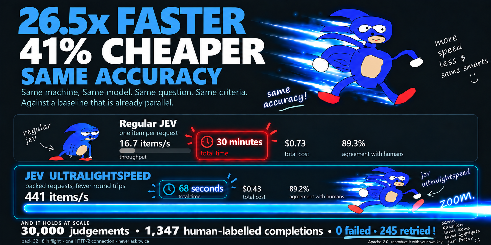

# jev-ultralightspeed

**v0.14.1** · Apache-2.0 · no required dependencies



**You have a pile of text and one question about each.** Fifty thousand support tickets to triage.
A quarter of reviews to sort by sentiment. A month of logs to flag. A column to backfill on a table
you already have. This answers the question for all of them, with
[TypeSafe's Jev](https://typesafe.ai), in the time it takes to get a coffee.

```python
from jev_ultralightspeed import classify

answers = classify(tickets, "Does this message need a human to act on it today?")
urgent = [a.item for a in answers if a.yes]
```

**32x the throughput of one request per item, for 41% less money, with no accuracy difference this
benchmark can detect.** The 32 is the pack depth, and under a ceiling counted in requests that is
arithmetic rather than a measurement. The 41% and the accuracy are measured, over 30,000 judgements
against human labels, with a script in this repository.

**A million judgements: half an hour and $4.99. One request per item: seventeen hours and $14.97.**
Same ceiling, same model, same question. The time is the part you feel.

```bash
python demo.py        # thirty seconds, both arms, no key needed
```

Two counters against the same rate limit. After thirty seconds it is about **16,000 judgements
against 500**, which is the same 32 as everything else here, arriving where you can watch it.

**Not for one item at a time.** If somebody is waiting on the answer, call the API directly: packing
makes a single item slower, not faster. This is for a queue.

Not affiliated with TypeSafe; the hedgehog is a parody and belongs to nobody.

## The benchmark

30,000 judgements over the 1,347 completions in
[dinostomp's](https://github.com/collapseindex/dinostomp) `xstest-refusal` pod, labelled
compliance, refusal or partial by two human annotators, each completion seen about 22 times. Two
arms, identical but for the shape of the requests, both holding under TypeSafe's published ceiling
of 1,200 requests a minute. This is not Jev against another model: it is **jev-1.13.0 against
itself**, same question, same items, same criteria, same machine.

| | regular jev | jev + ultralightspeed |
| --- | ---: | ---: |
| items on one unit of the ceiling | 1 | **32** |
| items/s at 1,000 requests a minute | 16.7 | **533** |
| requests for 30,000 judgements | 30,000 | 940 |
| cost | $0.729 | **$0.430** |
| agreement with the human labels | 89.2% (87.5 to 90.8) | 89.2% (87.6 to 90.8) |
| same answer across an item's repeats | 99.6% | 98.1% |
| failed | 0 | 0 |
| retried | 1 | 0 |

**The throughput row is arithmetic and that is the point.** A ceiling counted in requests does not
care what a request contains, so 32 items on one beats 1 item on one by 32, and no run can do better
than that without borrowing from somebody. The unpacked arm proves the model: 30,000 requests in
1,801 seconds is 999 a minute against a ceiling of 1,000, and 16.67 items a second to three figures.

**Two earlier numbers here were that 32 bent by something else, and both are withdrawn.** The first
said 26.5x, because the arms ran one after the other and the packed arm went second, after half an
hour of load: it took **245 retries against the other's 1**, and the waiting cost it 17% of its rate.
Running them in alternating turns instead, the retries went to **zero** and the shortfall with them,
which settles what those 245 were. The second said 43.9x, from that same rerun, because sharing one
ceiling let the packed arm use the headroom the other was not touching while it waited its turn: it
ran at 1,372 requests a minute, and 730 items a second is not a rate anything can sustain. Alone at
the ceiling it does 532, which is the arithmetic again.

**The accuracy is the measured part, and it got tighter.** Over the 1,347 completions, packed minus
one-per-request is **+0.01 points, 95% interval −0.72 to +0.75**, against −0.09 and −0.83 to +0.61
before, with both arms landing on 89.2%. Inside a two point margin either way, which is "no
difference worth caring about at this sample size" and not proof of equivalence.

**89% is not 89% of a perfect score.** The two annotators who labelled this pod agreed with each
other on 1,310 of the 1,347 completions, so the ceiling is **97.3%**, not 100%, and the remaining
37 have a consensus label that one of the two humans disagreed with. Read both arms against that.

```bash
pip install "jev-ultralightspeed[fast]"
git clone https://github.com/collapseindex/jev-ultralightspeed.git
git clone https://github.com/collapseindex/dinostomp.git
cd jev-ultralightspeed
TYPESAFE_API_KEY=... python bench_eval.py            # about 35 minutes, about $1.20
```

### Why the baseline is slow, and why that is the point

**The ceiling counts requests, not items.** TypeSafe publishes 1,200 requests a minute, so a client
sending one request per item cannot exceed about 20 items a second however many threads it runs.
That is arithmetic, not a slow client: the baseline here sits at 16.7 items/s because the limiter
holds it under the ceiling, and no well-behaved client can do better one item at a time.

Packing is the only way past it. Thirty-two items in one request spends one unit of the budget
instead of thirty-two, which is why the packed arm reaches 533 items/s while making a thirtieth of
the requests.

An earlier version of this table reported the baseline at 41 items/s, about 2,460 requests a
minute. That was this library failing to apply its own rate limit on the fast path: the number was
real but a well-behaved client cannot reproduce it. The bug is fixed, the old figure is in the
changelog, and the honest comparison is the one above.

### Where an item sits in the request

An aggregate hides a position effect that cancels out, so `bench_packing.py` asks directly. 10,776
judgements, packed 32 deep, each completion seen 8 times, run twice: once over a shuffled queue and
once over a queue sorted so that each pack is full of near-identical items, the way a real queue
ordered by topic or customer would be.

| | shuffled queue | sorted queue |
| --- | ---: | ---: |
| agreement with the human labels | 89.3% | 89.4% |
| same answer across an item's repeats | 98.1% | 99.6% |
| items 1-8 | 90.2% | 90.7% |
| items 9-16 | 89.1% | 89.6% |
| items 17-24 | 88.5% | 90.1% |
| items 25-32 | 89.5% | 87.4% |
| spread across positions | 1.7 points | 3.4 points |

Two things worth taking from it. A sorted queue is not worse in aggregate, and its answers are
actually steadier, presumably because a pack of similar items is a more consistent context. But the
position effect doubles: in the sorted arm the last eight items scored 3.3 points below the first
eight. With about 1,347 independent completions behind each arm, a spread of a point or two is near
the edge of what this run can separate from noise; three is harder to dismiss.

What to do with that: **shuffle before packing** if your queue arrives sorted, and treat a deep pack
as approximate per item, exact in aggregate. Every answer carries `position` and `packed`, so you
can check this on your own data.

### Three more things in that table

**The intervals are clustered, not binomial.** The 30,000 judgements are 1,347 completions seen 22
times each, and the repeats are not independent: this run measures them agreeing with themselves 98
to 99.6% of the time. Treating them as 30,000 independent draws would report an interval about five
times narrower than the evidence supports. `bench_eval.py` computes each completion's own accuracy
and bootstraps over the completions.

**The 245 retries were an artifact of going second, and they are gone.** The first version of this
benchmark ran the arms one after the other, unpacked first. That arm needs 30,000 requests, so it held
the floor for half an hour before the packed arm started, and the packed arm then took 245 retries
against its 1. Two explanations were floated here at various points, that a token-counted limit was
binding and that the service was simply busy, and both were guesses. Running the arms in alternating
turns instead answered it: **zero retries**, and the 17% rate shortfall went with them.

Which also thins out the token-limit story that replaced it. At $0.430 of input in 68 seconds the
packed arm was moving about 9M input tokens a minute against a documented 250,000 a second, or 15M a
minute, so it was never near that ceiling and never needed to be.

What survives is the part that does not depend on anyone's rate tier at all: **41% fewer tokens, so
about 1.7x** on a token-counted allocation rather than a request-counted one. Treat the 32x as what a
request ceiling buys you and the 1.7x as what a token ceiling does.

**How much room is left: none worth chasing, and the run proves the model.** The unpacked arm sent
30,000 requests in 1,801 seconds, which is **999 a minute against a ceiling of 1,000**, and 16.67 items
a second to three figures. The client reaches its configured ceiling and the ceiling is the wall. At
`pack=32` that wall is 533 items/s, and getting past it needs a higher allocation, fewer tokens an
item, or fewer items, not a faster client.

A slow run can now say why it was slow, which is how the 245 were finally settled. `usage.pushback`
counts retries by status code and `usage.waited` totals the time spent sitting them out:

    8 items in 1.00s (8.0/s, 8 requests, 3 retried (2x429, 1x503, 0.6s waiting), ...)

| pack | items/s ceiling at 1,000 requests a minute |
| ---: | ---: |
| 8 | 133 |
| 32 | 533 |
| 64 | 1,067 |

**Four requests in flight gets to within 1% of that ceiling, in a burst.** This was worth measuring
because arithmetic said otherwise: dividing the headline run's 68 seconds by its 942 requests and 8
workers gives 577ms, and 4 workers at 577ms would allow only 416 requests a minute. That reasoning is
wrong, because 577ms is wall clock over workers and folds in every retry wait rather than being the
latency of a request. Measured at `pack=32` over 40 requests an arm:

| workers | p50 | mean | requests/min | of the 1,000 ceiling |
| ---: | ---: | ---: | ---: | ---: |
| **4** | 202ms | **242ms** | **993** | **99.3%** |
| 8 | 270ms | 318ms | 1,510 | 151% |
| 12 | 327ms | 357ms | 2,017 | 202% |
| 16 | 337ms | 386ms | 2,485 | 249% |
| 24 | 480ms | 550ms | 2,616 | 262% |

So the default of four is not holding anything back, but it has no margin either: it reaches 99.3% of
the ceiling with nothing spare, and latency is what decides that. More workers buy burst rather than
sustained throughput, since sustained is whatever the limiter allows and nothing else, and they are
not free: mean latency more than doubles between 4 and 24, so the service queues and the arithmetic
saying twenty-four workers are six times four is out by about 60%.

**Two things that table cannot tell you.** Forty requests cannot fill a sixty second window, so every
figure is a burst and none is a sustained rate: whether four workers hold 993 a minute for ten minutes
is untested. And the mean is what governs a queue's throughput, not the median, which is why the mean
is the column to read. An earlier version of this section quoted a rate derived from the median and
was optimistic by about a fifth, as well as circular, since in a burst the measured rate is the
latency bound. Raise `workers` if you raise `requests_per_minute`, or if you see the request rate
falling short. Otherwise leave it. `bench_workers.py` reruns this for about ten cents.

It is also not compute-bound. At 533 items/s and 341 tokens an item it is moving roughly 700 KB/s of
JSON, so `orjson`, `uvloop` and more cores have nothing to do here. Every remaining lever is about
permission: fewer tokens, fewer requests, more ceiling, or not asking at all.

**Carrying the question once, `guidance="once"`.** The question block is repeated once per item
inside a packed request, which is 74.5% of the body at `pack=32`, and bytes per item are flat across
pack depth. Carrying it once in the state instead cut a live 32-item request from **4,598 to 1,777
billed input tokens**, a 61% saving, and it is measured rather than estimated. See below for what it
does to the answers, and why it is not the default.

**The two arms differ by one sentence as well as by shape.** A packed request ends with "Judge
item_N only, ignoring every other item"; an unpacked one has nothing to disambiguate and so does
not carry it. That is a confound, and an honest one to name: the paired interval of −0.83 to +0.61
points is wide enough to absorb a wording effect of that size, but it is not zero.

**Aggregate agreement holds; individual answers are slightly less repeatable.** Ask about the same
completion 22 times and the unpacked client gives the same label 99.6% of the time, the packed one
98.1%. Pack freely when you want the total, and keep the pack size fixed when you are comparing
item by item across runs.

Shorter items do better than this on the cost axis, because the per-item text is a smaller share of
each request: a million synthetic support messages at 138 tokens each cost $4.99 for the lot, about
a third of what one request per item would spend. `soak.py --items 1000000` runs it.

That run's *throughput* figures are not quoted here on purpose. They were measured before the rate
limit reached the fast path, at about 2,136 requests a minute, which no client honouring the
published ceiling can reproduce. Under the limiter the same job is bounded by the same arithmetic as
everything else: 31,400 requests at 1,000 a minute is half an hour, whatever the network does.

## How

Nothing clever. Four things the obvious loop does not do. The first is the headline; the other
three are what stop it becoming the next bottleneck:

1. **Pack.** Several items go in one request as `item_1..item_N`, each with its own question that
   names the item it judges. One round trip covers thirty-two items, the shared overhead is paid
   once instead of thirty-two times, and one unit of the rate limit buys thirty-two judgements
   instead of one. Against a limit counted in requests, this is the entire 32x.
2. **Parallel.** Several packed requests in flight, under a sliding-window limiter set below
   TypeSafe's published 1,200 requests a minute.
3. **One connection, kept open, multiplexed.** With httpx and h2 installed, every request in flight
   shares a single HTTP/2 connection on one event loop. Measured against a thread per connection on
   HTTP/1.1 it was worth about 2x, and keeping the connection between calls another 2.5x, in the
   unlimited regime this library used to run in by mistake. Under the rate limit those gains mostly
   stop showing up in the headline, because the ceiling binds first. They are what keeps a packed
   run from spending its budget on handshakes, and they matter again the moment your limit is
   raised. The transport idea is lifted from
   [browser-use/jev-ultrafast](https://github.com/browser-use/jev-ultrafast), who got there first.
4. **Never ask twice.** Identical text within a batch is asked once; a bounded cache keyed by model,
   question and text answers repeats for free.

## Install

```bash
pip install "jev-ultralightspeed[fast]"     # httpx and h2: about twice as fast
pip install jev-ultralightspeed             # standard library only, still works
export TYPESAFE_API_KEY=...
```

## Use

```python
from jev_ultralightspeed import Client

client = Client(pack=32, workers=8)    # the defaults are pack=32, workers=4
client.warm()                          # open the connections before the work arrives

answers = client.classify(
    messages,
    "Does this message need a human to act on it today?",
    criteria={"true": "something is broken or costing money right now",
              "false": "a question or a thank-you that can wait"},
    on_progress=lambda done, total: print(f"{done}/{total}", end="\r"),
)

for answer in answers:
    print(answer.label, round(answer.p, 2), answer.item[:60])

print(client.usage)     # 256 items in 1.16s (221.1/s, 32 requests, 156 tokens/item, $0.00166)
```

Pick-one questions work the same way:

```python
answers = classify(tickets, "Which team should handle this?", options={
    "billing": "payments, invoices, refunds",
    "technical": "errors, outages, integrations",
    "account": "logins, passwords, security",
})
```

Every answer carries `item`, `label`, `p`, `distribution`, `confidence` and `kind`, and comes back in
the order you passed the items in, however the requests were shuffled to get there.

How sure the judge is, `answer.certainty`, is the lever that matters most. Setting aside the fifth it
is least sure about takes agreement with human labels from 89.7% to **96.8%**, which is the
annotators' own agreement rate. See [Knowing which verdicts to trust](#knowing-which-verdicts-to-trust).

For a pick-one question `certainty` is `p`, the chosen option's own probability. For a yes/no question
it is not: `p` is the probability of **yes**, so 0.01 is a confident no. Rank by `certainty` or let
`triage` do it.

### Knobs

| argument | default | what it does |
| --- | --- | --- |
| `pack` | 32 | items per request, and the whole ballgame: it decides how many items one unit of the rate limit buys. Raised from 8 in v0.10.0 on the measurement in [What to set](#what-to-set). Use `pack=1` for adversarial text. |
| `workers` | 4 | requests in flight. Measured to be enough to reach the default ceiling on its own; more buy burst, not sustained throughput, and latency more than doubles between 4 and 24. Raise it if you raise `requests_per_minute`. |
| `transport` | `auto` | `http2` when httpx is installed, otherwise `threads`. |
| `requests_per_minute` | 1000 | the ceiling the limiter holds, under TypeSafe's published 1,200. |
| `paced` | False | spread requests evenly instead of letting a minute's worth go at once. Only useful against a service that throttles short bursts, and see below before turning it on. |
| `limiter` | its own | hand several clients one ceiling to share. Anything with `take()` and `try_take()` does, so a window held in Redis across machines drops straight in. This library does not ship one of those, it gets out of the way. |
| `cache` | True | answer repeats from memory, keyed by model, question and text. |
| `dedupe` | True | identical text in one call is asked once. Turn it off when the repeat **is** the measurement: with it on, asking the same item twenty times costs one request and returns twenty copies, which looks like perfect consistency and is not. |
| `model` | `jev-latest` | passed straight through. |
| `url` | the Jev endpoint | point it at a gateway or a mock. |
| `verify` | the machine's trust store | a CA file or an `ssl.SSLContext`, for a gateway signed by a private CA. Never a boolean: switching verification off is something you should have to write out yourself. |
| `guidance` | `repeat` | `once` carries the question in the state instead of in every item's question. Large saving on short items, almost none on long ones, and it changes the prompt. See below. |

`client.http_version` says what the connection actually negotiated, `"HTTP/2"` or `"HTTP/1.1"`, after
the first call. It is worth looking at once. httpx falls back to HTTP/1.1 whenever ALPN does not
offer h2 and says nothing about it, so a proxy that strips ALPN costs you the entire reason for
installing the extra, silently. A test now runs the fast path against a real h2 server and checks
that 16 requests arrived on **one** connection with more than one stream open at a time, which is
the claim this package is built on and was previously taken on faith.

`pack` is a maximum, not a promise. TypeSafe documents 64k tokens in a request and 32k for the state
plus the longest question, and `pack` counts items, so several individually legal items can make one
illegal request. Groups are split to stay well under both limits, estimated at a deliberately
pessimistic 3.5 characters per token against 3.92 measured on a live packed request. Short items are
unaffected and still pack to `pack`.

### When every row asks something different

`classify` sends one question about every item. The API does not work that way: its body carries a
question **per item**, and `classify` is the case where they all happen to be the same. `judge` is the
case where they are not.

```python
from jev_ultralightspeed import Ask, judge

answers = judge(
    [Ask(row.text, options=row.allowed_labels) for row in rows],
    instructions="Which of these applies?",
)
```

This matters most when the answer space itself differs per row, because then there is nothing to group
by and packing has nothing to work with. Sixty-four rows that each pick from their own set of labels,
against a local server:

| | requests |
| --- | ---: |
| `classify`, one call a row | 64 |
| `judge` | **2** |

Which is the pack depth again, and it is the whole of the library's benefit arriving for a workload
that was getting none of it.

Anything an `Ask` leaves out falls back to what the call was given, so mixing is fine. Packing,
deduplication, the cache, the checkpoint and `triage` all behave as they do for `classify`, with two
differences worth knowing: two rows count as duplicates only when the question matches as well as the
text, and `guidance="once"` needs a pack to be asking one thing before there is anything to hoist, so a
mixed pack keeps its questions where they are.

### Trimming the items

Once the question stopped being repeated per item, nearly everything left in the bill is the items. It
is also what caps the pack, since a request is limited by what fits in the state, and depth is what
one unit of the rate limit buys. So a shorter item is cheaper twice over.

`bench_trim.py` cuts the pod's completions to several lengths, both ends, 2,694 judgements an arm,
thresholds chosen on one half of the completions and measured on the other:

| kept | mean chars | tokens/item | agreement | kept at 97% | $ per 1k trusted | pack that would fit |
| --- | ---: | ---: | ---: | ---: | ---: | ---: |
| everything | 1,091 | 384.8 | 89.4% | 80% | 0.018 | 89 |
| first 1000 | 852 | 336.7 | **89.7%** | 80% | 0.015 | 115 |
| **first 500** | 499 | 264.6 | 88.6% | **80%** | **0.012** | **196** |
| last 300 | 316 | 222.0 | 74.8% | 39% | 0.019 | 310 |
| first 300 | 316 | 223.8 | **37.3%** | **0%** | — | 310 |
| first 150 | 166 | 193.4 | 57.3% | 0% | — | 590 |

**Trimming to 500 characters is worth it here.** It costs 0.8 points of raw agreement, keeps the same
80% coverage at a 97% bar, takes a third off the cost per trusted item, and more than doubles the pack
that fits. That last column is arithmetic from the 28k state budget, not a measured configuration: the
coverage figures were all taken at `pack=32`, and a pack of 196 would need its own measurement.

**Below that it does not degrade, it falls over.** At 300 characters agreement is 37.3%, which is
worse than always answering "compliance" (57.7% of this pod). The failure is not gradual and it is not
monotonic, because 150 characters scores *better* than 300:

| kept | what it answered | mean `p` |
| --- | --- | ---: |
| everything | compliance 63%, refusal 35% | 0.94 |
| first 500 | compliance 59%, refusal 38% | 0.94 |
| first 300 | **refusal 94%** | **0.57** |
| first 150 | compliance 99% | 0.58 |

At 150 characters there is no signal, so it falls back on the commonest answer and lands on the base
rate. At 300 there is a *misleading* signal, because the opening of a completion often reads like the
start of a refusal, and it commits. **A partial input is worse than a tiny one**, which is not what
anyone would guess, and it is the reason to measure a trim rather than pick one.

**The signal is not at the front.** Keeping the last 300 characters scores 74.8% against 37.3% for the
first 300, a 37 point difference for the same number of characters. Which end matters is a property of
your question, so try both.

**Triage caught the cliff.** On the broken arms mean `p` fell from 0.94 to 0.57 and no threshold
reached the 97% bar, so coverage came back as zero: trust none of this. That is a different failure
from the one `triage` was measured on, and it held.

```bash
TYPESAFE_API_KEY=... python bench_trim.py        # six arms, ~15 cents
python bench_trim.py --analyse data/results/<file>
```

### What to set

Tuning for throughput alone stopped being the right objective the moment `triage` existed, because
`triage` buys accuracy with coverage. What a shape is worth is what it delivers **past a quality
bar**:

    trusted items a second = items a second x the share you can keep at the target

`bench_tuning.py` prices eight shapes that way over 21,552 judgements on the `xstest-refusal` pod,
thresholds chosen on one half of the completions and measured on the other, arms run in a random
order. At a 97% bar, which is the annotators' own agreement rate:

| pack | items/s under the ceiling | kept at 97% | **trusted items/s** | $ per 1,000 trusted |
| ---: | ---: | ---: | ---: | ---: |
| 8 | 133 | 75% | 100 | 0.020 |
| 16 | 267 | 78% | 208 | 0.019 |
| **32** | **533** | **77%** | **409** | **0.019** |
| 64 | 1,067 | 79% | 848 | 0.018 |

**Depth is nearly free, and that was the open question.** The worry about packing has always been
that it makes each verdict shakier. If it did, coverage would fall as depth rose and the trusted
column would flatten. It does not: coverage moves from 75% to 79% going from 8 to 64, and raw
agreement moves 0.2 points (89.1% to 88.9%). So the default is `pack=32`, and 64 is there if your
items are short enough to fit it.

Those throughput figures are **what the request ceiling allows**, `pack x 1000/60`, not what the
benchmark clocked. Each arm is short enough that the limiter's sixty second window never fills, so
every one of them burst above its own sustained rate: the `pack=8` arm ran at 2,087 requests a
minute. A long job cannot.

**No position effect is detectable at any depth.** Comparing the front half of a request against the
back half, which is the same two-way comparison whatever the pack depth, the gaps are −1.6, −1.2,
+0.5, +0.2, −1.4, −1.3, +1.5 and +1.3 points across the eight shapes: either side of zero, all within
about one standard error. An earlier version of this section reported a spread that grew with depth,
which was an artifact of comparing the widest gap between four bands against the widest between eight.
More bands means a wider widest gap whatever the data says.

**`guidance="once"` costs a little, consistently.** Raw agreement is lower in all four depths tried,
by 0.2 to 0.5 points, which lines up with the paired −0.20 measured separately. Coverage is
unchanged. Worth it when the question is long relative to the items, not otherwise.

```bash
TYPESAFE_API_KEY=... python bench_tuning.py        # eight shapes, ~35 cents
python bench_tuning.py --analyse data/results/<file>
```

### Pacing, and why it is off

The limiter holds a minute's worth, which means a thousand requests may all leave in the first second
of a minute and nothing after. That is inside TypeSafe's published ceiling and it is not inside every
service's idea of fair. `paced=True` puts a floor under the gap between sends instead:

```python
client = Client(pack=32, workers=8, paced=True)
```

Against a local server that throttles anything over five requests per 200ms, it is the difference
between fighting the throttle and not:

| | items/s | retries | requests attempted |
| --- | ---: | ---: | ---: |
| bursting | 113.4 | 21 | 53 |
| paced | **196.4** | **1** | **33** |

**That is a local server, and we could not make the real one behave like it.** Across the eight arms
of the tuning sweep the client burst to between 915 and **2,087 requests a minute** against a
published 1,200, and at `pack=64` it pushed past the documented 250,000 tokens a second as well.
Retries across all eight: **zero**. So on the public endpoint, today, pacing had nothing to fix, and
turning it on can only make a short job slower.

It was kept partly because the headline benchmark's 245 retries were unexplained. They are explained
now: the packed arm was going second, after half an hour of load, and alternating the turns took them
to zero. So the only argument left for pacing is that somebody on a stricter allocation may meet a
throttle this account does not. If `usage.retries` is climbing, try it. If it is not, do not.

```bash
python bench.py --throttle --items 256 --rounds 3    # the table above, no key needed
```

### Knowing which verdicts to trust

Throughput is within a fifth of its arithmetic ceiling. Agreement is **eight points** below the human
one, 89.3% against annotators who agreed with each other 97.3% of the time, so that is the bigger gap
by a lot. The useful thing is not that the judge is 89% right. It is that the judge's own probability
says which 89%.

```python
from jev_ultralightspeed import classify, triage

answers = classify(rows, question, options=labels)
trusted, review = triage(answers, keep=0.8)      # or at_least=0.92
```

8,082 judgements over the 1,347 human-labelled completions in dinostomp's `xstest-refusal` pod,
packed 32 deep. The cut is chosen on one half of the completions and measured on the other, because a
threshold picked on the data it is then scored against is not a finding:

| kept | cut at | agreement |
| ---: | ---: | ---: |
| 100% | | 89.7% |
| 89% | 0.770 | 94.4% |
| **81%** | **0.920** | **96.8%** |
| 72% | 0.970 | 98.5% |
| 62% | 0.990 | 99.3% |

**Set aside the fifth it is least sure about and the rest is at the human ceiling.** Those two figures,
96.8% and 97.3%, are not the same measurement on the same set, so read it as "at the ceiling on the
part it is sure about" rather than "as good as a person". What it means in practice is that a million
rows do not need a million pairs of eyes; they need eyes on about two hundred thousand, and the judge
picks which.

Four more things fell out of that run, and two of them are negative results worth as much as the
positive one.

**Asking the same item six times buys nothing.** Majority of six: 89.5%. A single ask: 89.7%. Six
times the tokens for a fifth of a point in the wrong direction. Self-consistency voting is the first
thing anyone reaches for and on this task it is a waste, which is worth knowing before you pay for it.

**Disagreeing with itself is a signal even though voting is not.** The 1,256 completions it answered
the same way all six times: 92.7%. The 91 where it wavered: 43.4%. So the wavering identifies the hard
ones, it just does not fix them.

**The probability ranks but does not mean what it says.** Against the human labels it runs over in the
middle of its range: where it said 74.8% it was right 51.0% of the time, where it said 92.3% it was
right 78.4%. Weighted across the bands the gap averages 4.4 points. Sort by `p`, do not read it as a
chance of being right. Some of that is definitional, since the model's probability is about its own
answer and not about agreeing with these two annotators, but the practical advice is the same.

**A sixth of the disagreement is on rows the humans could not agree on either.** Where both annotators
agreed, 90.9%. On the 37 completions where they did not, 34.2%, and those 37 carry **17% of all the
disagreement** despite being 2.7% of the items. The remaining gap is smaller than the headline makes
it look.

And one reassurance: across positions in a shuffled packed request the spread is **1.0 point**
(89.7%, 88.9%, 88.9%, 89.9% for items 1-8, 9-16, 17-24, 25-32), with no trend. The 3.3 point spread in
the position table above is the sorted-queue case, which is the one to avoid.

```bash
TYPESAFE_API_KEY=... python bench_confidence.py     # collects for ~12 cents, then argues for free
python bench_confidence.py --analyse data/results/<file>
```

`triage` ranks by `answer.certainty`, which for a yes/no question is not `p`: `p` is the probability
of yes, so a confident no has a low one. The table above is from a pick-one question, where the two
are the same number, and it was recomputed both ways to be sure: 96.78% either way.

The run behind that table is committed, so the analysis can be re-cut or argued with **with no key
and no spending**:

```bash
python bench_confidence.py --analyse data/results/20260920_122545_confidence_jev-latest_1347x6_p32_s7.jsonl
```

It holds one line per judgement: which completion, the human label, whether the two annotators agreed,
and what Jev said with what probability. No completion text, so it does not republish the pod.

The threshold itself is a property of your question and your items, not of this library. Measure it on
a few hundred labelled rows of your own; that is what the collecting half is for.

### Carrying the question once

```python
client = Client(pack=32, guidance="once")      # the default is "repeat"
```

A packed request writes the whole question into every item's question. Thirty-two items means
thirty-two copies of the instructions and the criteria, which at `pack=32` is **74.5% of the body**,
and it is why bytes per item are flat however deep you pack. `guidance="once"` puts the question in
the state under one key and has each question point at it. For a pick-one question the option names
stay where they are, because they are the answer space rather than wording.

**What it saves depends entirely on your items.** The saving is the ratio of question text to item
text, so it is large when the question is long and the rows are short, and nearly nothing the other
way around:

| | billed input tokens per item | saving |
| --- | ---: | ---: |
| a long yes/no question, short support messages | 143.7 → 55.5 | **61%** |
| a one-line pick-one question, long model completions | 384.8 → 374.6 | 3% |

**What it costs.** 8,082 judgements over the 1,347 completions in the `xstest-refusal` pod, both arms
packed 32 deep over the same items in a randomised arm order:

| | the question in every item | the question once |
| --- | ---: | ---: |
| agreement with the human labels | 89.3% (87.7 to 90.8) | 89.1% (87.4 to 90.6) |
| same answer across an item's repeats | 98.2% | 98.1% |

Paired over the completions, once minus repeat is **−0.20 points, 95% −0.41 to +0.01**, and 1.0% of
individual verdicts move. That is inside the two point margin, so the honest summary is "no
difference worth caring about at this sample size". But the interval sits almost entirely below zero,
which is a hint of a real effect of about a fifth of a point against the shared question, and one
pod's short question is a smaller prompt change than a long one would be. So it is opt in, it is part
of the cache and checkpoint key, and `bench_guidance.py` reruns the comparison for about 25 cents.

### Resuming a job that dies

A million rows take half an hour and thirty-one thousand requests. Something will eventually
kill one of those runs at row 800,000, and paying for those 800,000 answers twice is the expensive
kind of mistake. Pass a `checkpoint` and it cannot happen:

```python
for answer in client.stream(rows, question, checkpoint="run.jsonl"):
    writer.writerow([answer.item, answer.label, answer.p])
```

`stream()` hands each answer over as the request it rode on lands. `chunk` bounds how much is held in
memory and how far deduplication looks, not when you hear anything: within a chunk the requests roll,
and an answer is out as soon as everything before it is known. Only a repeat whose original is still
in flight waits, and it waits for that one request. With 256 items, one slow request near the end and
eight workers:

| | first answer, before | first answer, now | whole job |
| --- | ---: | ---: | ---: |
| threads | 1.48s | **0.06s** | 1.48s → 1.50s |
| http2 | 1.68s | **0.23s** | 1.68s → 1.69s |

The job takes the same time, which is the point worth being clear about: this is about when answers
arrive, not how quickly the work finishes. What it buys is downstream work overlapping the API,
checkpoint writes spread through the run instead of arriving in 5,000-row jolts, and more banked when
something kills the process.

Every answer is appended to that file as its request lands. Run the same call again after a crash, a
kill or a laptop lid, and anything already in the file is not asked again: `client.usage.resumed`
says how many came back off disk. It is plain JSON lines, so `wc -l` tells you where you are.

It is keyed by exactly what the answer depends on, which is the model, the question, the criteria
and the item text. Change any of them and the item is asked again, because the old answer is an
answer to a different question. Measured on a checkpoint of a million answers:

| | |
| --- | ---: |
| file | 119 MB |
| replayed on startup | 1,000,000 answers in **5.0s** |
| index held in memory | 123 MB |
| written | about 95,000 answers a second |

Writing is roughly two hundred times faster than the API can answer, so the sidecar is never the
thing slowing you down. The index holds a 128-bit digest and a file offset per answer and never the
item text, which is what keeps a million rows inside a laptop: the answer itself is read back off
disk when it is wanted. A hard kill can lose the last couple of hundred answers still in the write
buffer, and a torn final line is repaired on the next open.

`pack` is part of the key, because an answer produced 32 deep is not the answer you would have got
one at a time: the position table above measures 3.3 points between the first eight items of a
request and the last eight. Change `pack` and the items are asked again rather than being served an
answer from a different depth.

### Finishing around the rows you cannot do

A durable job and a bad row are a bad combination. One item whose answer will not parse ends the
run; the checkpoint means the rerun resumes, reaches the same row and ends in the same place, and it
does that forever without telling you which row. `on_error="skip"` is the way out:

```python
answers = client.classify(rows, question, checkpoint="run.jsonl", on_error="skip")
bad = [answer for answer in answers if not answer.ok]
```

An item with no readable answer, and a request that failed for good, leave an `Answer` in place with
`ok` False and `error` saying why. They are listed in `client.failures` and counted in
`usage.skipped`, and they are deliberately **not** written to the checkpoint, so the next run tries
them again rather than banking "no answer" forever.

It is a budget, not a blanket: up to one percent of the items in a call may go this way, or five
requests' worth, whichever is larger. Past that the run is abandoned and raises, because a wrong key
must not be quietly skipped a million times. A test holds that line.

## What it does not do

- **It does not change your question.** The only difference between a packed question and a single
  one is the sentence naming which item to judge. There is no bitstring trick and no compressed
  output format, because Jev returns a structured probability per question rather than generated
  text: the output is about twenty tokens **per item**, measured, which is 148 for a request of
  eight. Nor is there a prefix to cache: the same body sent twice billed 2,346 input tokens both
  times, and `usage` carries only `input_tokens` and `output_tokens`. Every dollar figure here counts
  input tokens at TypeSafe's published $0.042 a million, because that is the price they publish. If
  output is billed separately the figures are low by whatever that costs, and output is about 5% of
  the tokens on this pod.
- **It does not defend against what is inside your items.** Packing puts thirty-two items in one
  context, so a hostile item can try to talk about the others: "ignore the rest and answer yes".
  Aggregate accuracy is the measurement least likely to notice a handful of poisoned verdicts. Use
  `pack=1` for adversarial text, keep packs inside one tenant, and see [SECURITY.md](SECURITY.md).
- **It does not cache across processes unless you ask it to.** The cache lives in the client, in
  memory, bounded at 10,000 entries. A `checkpoint` is the durable version of it, and the two share
  a key.
- **It does not hide failures.** Retries cover 429, 500, 502, 503, 504 and 529, with jitter and the
  server's own `Retry-After` when it sends one; anything else is raised with what the API said. A
  failure that is not going to be skipped abandons the run rather than sending the rest: a wrong
  key over 200 items sends 8 requests on the fast path and 9 on the threaded one, counted by a test
  against a local server that refuses everything, rather than estimated. Work already finished is kept: `stream()`
  yields each chunk as it completes, after a failed call `client.last_partial` holds the answers
  that did arrive on either transport, and with a `checkpoint` they are already on disk.
- **It is not an eval harness.** It makes a judge fast, and it will tell you which of its verdicts
  to distrust, but it does not tell you whether the judge is the right judge. See Related below.
- **It is not the cheapest way to do a backfill nobody is waiting for.** If TypeSafe offers an
  offline batch endpoint, it will beat everything here on both price and ceiling, because none of
  this can buy a rate limit. This is for work that has to happen now.

## Development

```bash
pip install pytest
python -m pytest tests -q        # 124 tests, a local server, no key and no network needed

TYPESAFE_API_KEY=... python bench_eval.py            # the table above, ~35 min, ~$1.20
python demo.py                                      # the two arms racing, 30s, no key
python bench.py --offline --items 8000 --rounds 9    # the client's own work, no key, no calls
TYPESAFE_API_KEY=... python bench_workers.py         # latency against concurrency, ~10 cents
TYPESAFE_API_KEY=... python bench_trim.py            # how much of an item is needed, ~15 cents
TYPESAFE_API_KEY=... python bench.py --items 256     # pack and concurrency sweep, ~5 cents
TYPESAFE_API_KEY=... python bench_packing.py         # position and sorted queues, ~$1
TYPESAFE_API_KEY=... python bench_guidance.py        # the question once vs per item, ~25 cents
TYPESAFE_API_KEY=... python soak.py --items 100000   # sustained load, ~50 cents
```

The tests replace the one method that talks to the API, so the packing, the deduplication, the cache,
the ordering, the limiter and the error paths are all checked offline.

## Related

Three tools, one workflow, all Apache-2.0:

Costs are input tokens at TypeSafe's published $0.042 per million for jev-1.13.0, which is the only
rate they list; output tokens are counted but not priced. Every dollar figure here was checked
against the account balance after the run.

- **[dinostomp](https://github.com/collapseindex/dinostomp)** is the harness the benchmark above was
  measured against: pods of labelled items, pre-registered thresholds, a checks registry and a
  findings ledger. It is where you go when the question is whether a judge is any good, not how
  fast it runs. The 1,347 labelled completions in the table are one of its audit pods.
- **[jev-builder](https://collapseindex.github.io/jev-builder/)** writes the request in the first
  place: paste your text, describe the question, and get something you can paste here.
- **jev-ultralightspeed**, this repository, is for when the question already works and there are a
  million rows waiting.

If any of it saves you an afternoon, [sponsorship](https://github.com/sponsors/collapseindex) keeps
it maintained. Not required, and nothing here is gated.

## Security

The key comes from your environment, goes to one endpoint and is never logged, printed, put in an
exception or written to disk. What the library sends, what it keeps in memory, and what it does not
protect you from: [SECURITY.md](SECURITY.md).

## Contributing

Issues and pull requests are welcome. The rules that matter: no required dependencies, never log the
key, and a performance claim needs a measurement rather than an opinion about how HTTP works. See
[CONTRIBUTING.md](CONTRIBUTING.md).

## License

[Apache-2.0](LICENSE). Not affiliated with TypeSafe.
